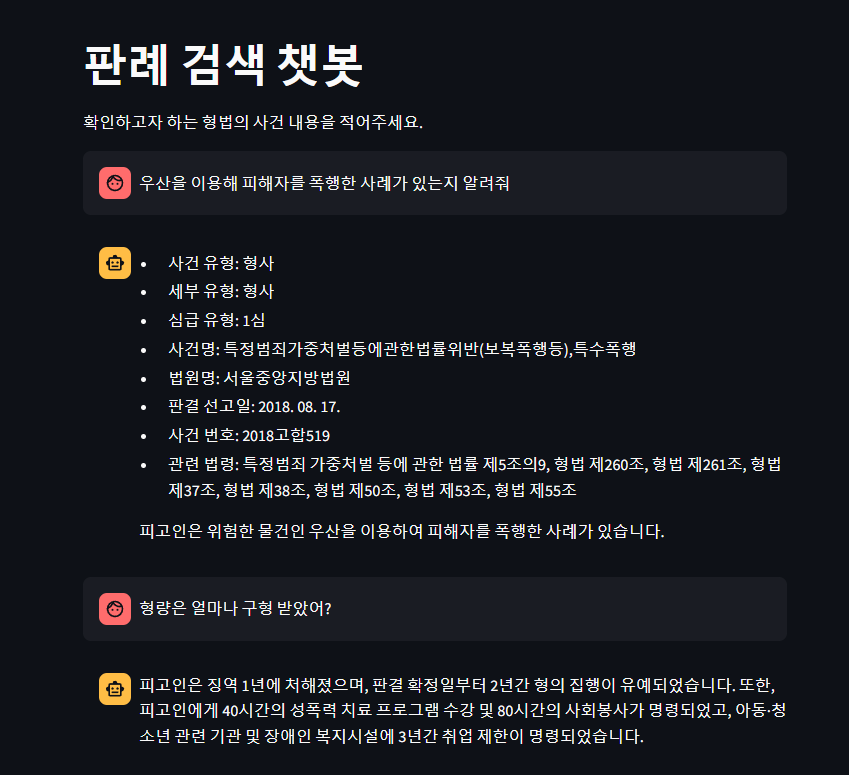

# Legal Case Search

<p align="center">
  
</p>

- 사건과 연관성이 있는 법률 또는 예상 형량에 대해 검색하는 기능 수행
- AIHub의 법률/규정 (판결서, 약관 등) 텍스트 분석 데이터 중 형사 데이터셋 사용(validation/293건)
- BM25 Retriever를 통해 검색기 성능 향상
  - BM25를 활용하여 법적 사례 검색 성능을 평가하여 COLIEE(Competition on Legal Information Extraction/Entailment) 대회에서 상위권 성과를 달성했다는 점을 참고하였음
  - Rosa, G. M., Rodrigues, R. C., Lotufo, R., & Nogueira, R. (2021). Yes, bm25 is a strong baseline for legal case retrieval. arXiv preprint arXiv:2105.05686.
- 데이터 중 10건을 사용하여 llm as a judge를 통해 평가
  - cot_qa를 통해 평가한 결과 정확도 90% 확인

### 파이썬 버전
`python 3.11.9`

### 가상환경 설정 방법
```python
poetry shell
poetry update
```

### Chatbot 실행방법
```python
poetry shell
streamlit run main.py
```